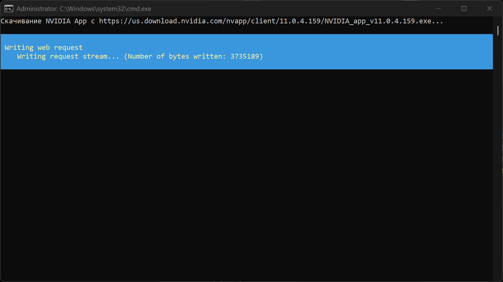

# NVIDIA App Silent Installer

A PowerShell script that automatically downloads and installs the **NVIDIA App** silently, allowing the user to choose the download folder via a graphical interface.

## 📦 Features

- Automatically fetches the latest version of the NVIDIA App from the official website.
- Prompts the user to select a download folder using a GUI folder picker.
- Installs the application in **silent mode** (no windows or prompts).
- Deletes the installer after successful installation.


## 📷 Screenshots



---

## 🧰 Requirements

- Windows 10/11
- PowerShell 5.1+
- .NET Framework (required for the folder selection dialog)

## 🚀 Usage

1. Download or clone the repository.
2. Run the script bat

   ```powershell
   run NvidiaApp.bat
3. Select folder to download
